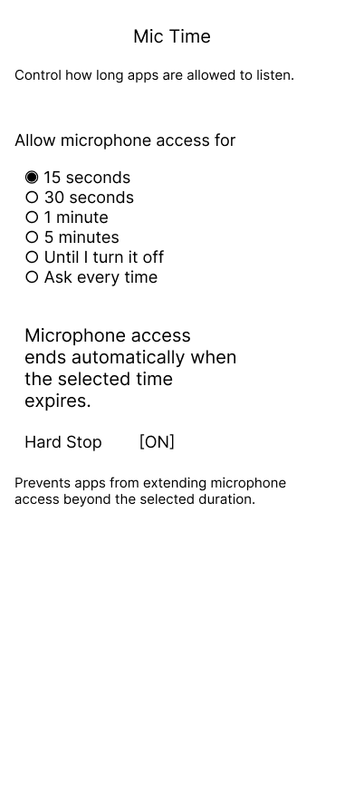
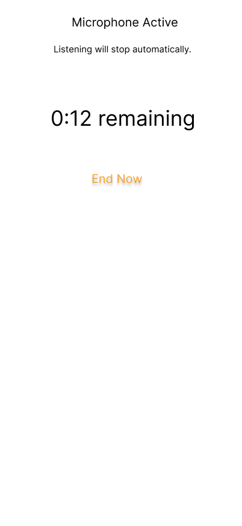

# mic-time

**mic-time** is a design concept for time-based microphone consent.

Instead of binary or always-on microphone permissions, users explicitly choose
*how long* a microphone may remain active (e.g. 15s, 30s, 1m, 5m). When the time
expires, access ends automatically — no silent extensions.

## Problem

Microphone permissions today are ambiguous. Even when products are safe, users
often feel uncertainty about when listening starts, how long it lasts, and when
it truly ends.

This uncertainty erodes trust.

## Concept

mic-time treats **time as consent**, similar to how Screen Time treats app usage.

Users select a listening window:
- 15 seconds
- 30 seconds
- 1 minute
- 5 minutes
- Until manually turned off
- Ask every time

When the window ends, microphone access stops automatically.

## Core Principles

- **Explicit duration** — listening is always time-bound
- **Hard stop** — access ends even if an app is still running
- **Visible state** — users can always see when the mic is active
- **No surprise behavior** — nothing continues silently

## UI Overview

1. Settings → Privacy → Microphone → Mic Time  
2. Mic Active indicator with countdown  
3. Mic Ended prompt with explicit extension options  

## UI Mockups

### Mic Time Settings

### Microphone Active

### Microphone Access Ended

## Why This Matters

This concept does not assume malicious behavior by apps.
It exists to remove ambiguity and reduce cognitive load.

Users should not have to wonder whether something they said will appear later.

## Status

Concept and UX specification.
Prototype implementation TBD.

## Author

[Hassan King]
